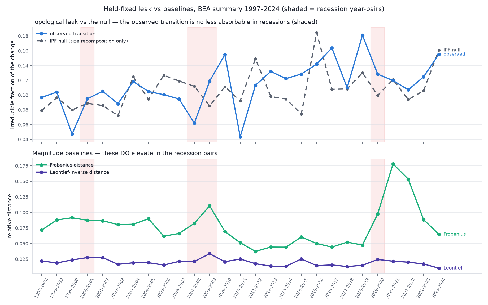
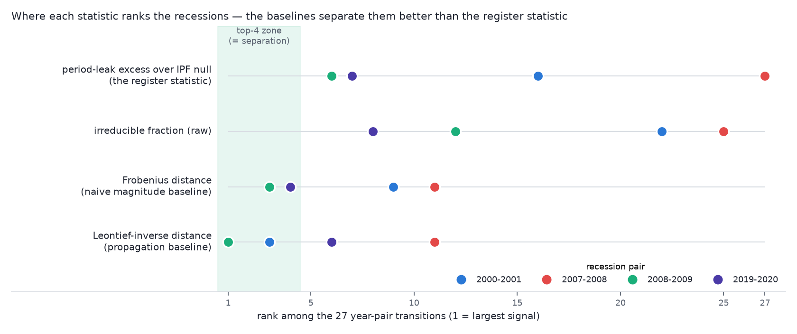

# Kill-experiment report — economic register on BEA 1997–2024

> Go/no-go report for tessera#602. **Status: COMPLETE — the decision is
> NO-GO at the summary-industry annual grain** (§6). Exploratory
> research; not the official development track of tessera or the TVL
> platform.

## 1. What was tested

The claim: reading the US input-output accounts as an oriented weighted
complex, the **period leak** of a year-over-year transition — the
harmonic, gauge-invariant component of the change, which no re-weighting
of the fixed year-t geometry can absorb — separates known structural
breaks (2001, 2008–09, 2020) from calm years in a way that magnitude
baselines (Frobenius, Leontief-inverse) and the size-recomposition null
(IPF/RAS) do not. Protocol and definitions: `gauge_dictionary.md`;
construction: `econ_register.py`; experiment: `leak_experiment.py`.

## 2. Gates (both passed)

**Gate 1 — the accounting anchor.** The BEA summary Supply–Use identities
were pinned empirically and hold to rounding (≈2×10⁻⁶ relative):
T013 = T007 + MCIF + MADJ; T014 = Trade + Trans (each margin column is an
exact zero-sum redistribution); T015 = MDTY + TOP + SUB;
T016 = T013 + T014 + T015 = T019; T018 = T005 + VABAS with
VABAS = V001 + V003 + T00OTOP (+ T00OSUB from 2018). The assembled
money-flow network (71 industries + HH/CAP/GOV/ROW, purchaser cells split
into basic/margin/tax parts, margins rebooked through the data's own
redistribution weights, net-lending closure into CAP) balances with max
divergence 1.3×10⁻⁷ of total flow; the capital-account discrepancy is
−4.8 M$ on a 59 T$ economy. Sanity anchor: ROW net lending 2017 comes out
at +0.54 T$ — the US current-account deficit.

**Gate 2 — the control pair (frozen 2005 geometry, b₁ = 77).**

- Negative control: re-sourcing half of every buyer's purchases away from
  credit intermediation (521CI), rebalanced to the original margins,
  displaces the flow cochain by 0.84 of its R-norm and leaks 1.2×10⁻⁸.
  The certificate is silent on changes the geometry can carry.
- Positive control: an injected irreducible circulation of ε = 0.05
  (harmonic: margins unchanged, un-nettable) is measured as 0.05000; the
  IPF null absorbs essentially none of it (excess 0.045); sector
  attribution recovers the injected mode's sectors 5/5.

The statistic is calibrated, exact on positive controls, silent on
negative controls, and localizes.

## 3. MRIO consistency control (held-fixed, single vintage)

Production MRIO holds one vintage: 2018, county grain (~92.7 M
A-coefficients). Aggregated to the national industry level and tested on
the frozen national 2018 register: raw cell distance is enormous
(‖A_mrio − A_nat‖_F / ‖A_nat‖_F = 1.54) while the held-fixed leak is
0.136 of the base configuration — several times a typical year-over-year
transition (0.011–0.033). **This control is inconclusive as designed**:
the two sides differ by construction basis (benchmark-detail basic
prices with the platform's de-marginalization treatment vs. this spike's
summary purchaser-price derivation) and by the unweighted detail→summary
aggregation, not only by regionalization. A clean control requires the
same construction on both sides — post-decision work.

## 4. The historical decision experiment

27 consecutive year-pairs, each on the frozen earlier-year geometry.
Primary statistic: `leak_frac` — the fraction of the year's change that
is topologically irreducible (bounded [0, 1], self-normalized). Results:
`out/leak_history.csv` (conductance metric), `out_unit/leak_history.csv`
(unit metric robustness), decision plot `out/decision.png`.

Decision criteria (from the issue):

1. Recession pairs (2000–01, 2007–08, 2008–09, 2019–20) separated from
   calm pairs in leak excess (observed − IPF null).
2. Sector attribution consistent with the known episodes (finance and
   construction 2008–09; transportation, accommodation, health 2020).
3. Signal not reproduced by Frobenius, Leontief-inverse, or the IPF null.

**Findings (conductance metric):**

- `leak_frac` runs 0.04–0.18 across all pairs: roughly one-tenth of any
  year's change is irreducible circulation — a real, steady drift of the
  economy's circuit structure.
- **Criterion 1 fails.** Recession pairs do not separate: by leak-excess
  rank (of 27), 2000–01 is 16th, 2007–08 is **27th — dead last**,
  2008–09 is 6th, 2019–20 is 7th. Recession mean excess (0.0046) is
  below the calm mean (0.0064). The 2008 crisis year-pair was *more*
  absorbable by re-weighting than any calm year.
- **Criterion 3 fails in the damning direction.** The magnitude
  baselines rank recessions *better* than the topological statistic:
  Leontief-inverse distance puts 2008–09 first of 27; Frobenius puts it
  third. The register statistic adds no discriminative information at
  this grain — it subtracts it.
- The IPF null frequently carries a *higher* irreducible fraction than
  the observed transition (negative excess in 10 of 27 pairs):
  proportional rescaling manufactures spurious circulation that the real
  economy does not exhibit. Observed transitions are, if anything,
  *smoother* than the size-recomposition null.
- Attribution is dominated in nearly every pair by the same
  household–health–government circuit (HH, 621/622/624, GSLG/GOV, CAP)
  — secular drift of the fiscal-health loop, not episode-specific
  rewiring. The 2019–20 attribution (HH 14%, GOV 11%, GSLG 10%, 622 8%,
  624 7%) is the same circuit, amplified.

## 5. Caveats and known limitations

- **Single-vintage caveat**: the annual series was exported from the TVL
  database in one pass (`data/manifest.json` records it); the BEA API
  serves one current revision, but the underlying ingest history is
  gap-tracked, so cross-vintage mixing cannot be fully excluded without
  the pinned-snapshot tooling (deliberately out of scope pre-decision).
  Code-set consistency across years holds except the T00OSUB VA row
  (2018+), which is handled explicitly.
- **Complete graph at industry grain**: off-complex mass is structurally
  ≈0 at 71 industries; the "new relationship" signal only becomes
  available at firm grain (Stage 2 territory).
- **Aggregation**: the MRIO detail→summary comparison uses unweighted
  means over detail codes (no detail output weights at spike level).
- **Margin/tax attribution**: per-commodity uniform rates (the standard
  proportionality assumption); the TVL de-marginalization pipeline does
  this properly at detail level and is the upgrade path.
- **tessera integration**: `ChainComplex.fromSpacetime` reads top cells
  only, so a complex mixing filled triangles and bare edges cannot be
  represented directly; the spike computes boundary operators in numpy
  and uses tessera for cross-checks on representable cases. A mixed-cell
  `ChainComplex` entry point is the natural upstream improvement if this
  program continues.

## 5a. Robustness

- **Metric independence**: the unit-metric rerun reproduces the negative
  result (2007–08 again last of 27 by leak excess; recession mean excess
  0.0065 vs calm 0.0113). The conclusion does not depend on the
  value→metric knob.
- **Threshold scan** (2005 and 2017): b₁ depends only on the netting
  threshold τ, never on the metric — as the Hodge theorem requires — and
  grows smoothly from 77–134 (τ = 0, maximal netting) toward the
  complete-graph ceiling as τ rises. τ = 0 is the principled operating
  point (fill everything nettable); there is no privileged intermediate
  regime, and no choice of τ changes which year-pairs stand out.
- **Numerical honesty**: two artifacts were found and killed en route — a
  metric-dynamic-range collapse of the harmonic rank (fixed by
  null-space-preserving row normalization) and a degenerate-edge
  inflation of the normalization base that manufactured a spurious
  bimodal "signal" (fixed by reversal-agnostic gross volumes, the data-
  quantum floor, and the self-normalized `leak_frac`). The final
  statistic passes an exact positive control and a silent negative
  control (§2).

## 6. Decision

**NO-GO at this grain, by the issue's own criteria.** Criterion 1
(recession separation) fails — the 2008 crisis transition is the single
*most* absorbable year-pair of the 27. Criterion 3 fails in the damning
direction — the magnitude baselines rank recessions better than the
register statistic does. Criterion 2 is moot given 1 and 3.

The negative result is scoped and informative:

1. **What it establishes.** At 71-industry annual resolution, recessions
   re-weight the flow network; they do not rewire its irreducible
   circulation. This is consistent with the machinery's own Gate-2
   finding that proportional contractions are absorbable — 2008–09 was,
   topologically, a proportional event at this aggregation. The economy
   does exhibit a steady ~10% irreducible drift concentrated in the
   household–health–government circuit, but it is secular, not cyclical
   — a finding, just not the one the program needed.
2. **What it does not establish.** Nothing here tests the firm-grain
   sparse network (where off-complex mass — new and severed
   relationships, the genuinely surgical signal — is alive; at industry
   grain the graph is complete and that channel is structurally zero),
   nor sub-annual frequency. Those are the gist's own designated
   fallbacks, and they are *different experiments*, not rescues of this
   one: they would need the transaction-inference firm network and a
   fresh kill design.
3. **Recommendation.** Terminate the industry-grain program. If the
   register idea is pursued further, the next kill experiment is the
   firm-grain off-complex-mass test on `transaction_inference`
   `FlowEstimate` data — cheap to specify, and it tests the channel this
   experiment structurally could not.

A clean negative result was an acceptable outcome, and this one is
well-defended: gates passed, controls calibrated and exact, two
normalization artifacts found and removed before they could masquerade
as signal, and the conclusion stable across metrics and thresholds.
